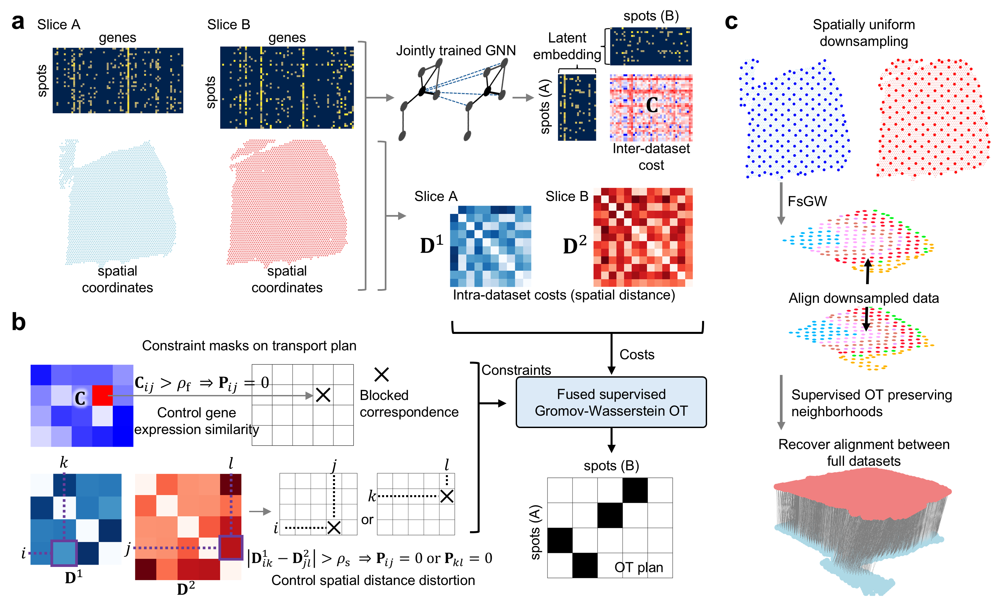

# RAFT-UP

RAFT-UP is a tool for robust spatial transcriptomics data alignment that infers overlap portion and provides explicit control over spatial distance
preservation. It provides tools for preprocessing, gene-cost construction, downsampling-based matching, full-resolution recovery, and visualization of alignment results.



## Basic usage

A typical workflow in RAFT-UP includes:

1. Preprocess the input slices and identify spatially variable genes using SOMDE.
2. Construct the gene cost matrix using spatial representation learning.
3. Compute the downsampled alignment.
4. Recover the full-resolution alignment.
5. Visualize and evaluate the matching results.

More details and tutorials are available at https://raftup-repo.readthedocs.io/en/latest/.

## Key parameters

Some important parameters used in RAFT-UP include:

- `rho_f1`: gene-expression cutoff used in the downsampled alignment stage.
- `rho_s`: spatial distance cutoff used in the downsampled alignment stage.
- `rho_f2`: gene-expression cutoff used in the full-resolution recovery stage.
- `rho_t`: spatial distance cutoff used in the full-resolution recovery stage.
- `k1`, `k2`: nearest-neighbor parameters used for construction of spatial cost in the full-resolution recovery stage.

## Installation

### Recommended installation

RAFT-UP uses several scientific Python packages with version-sensitive dependencies.  

For a reproducible installation, we recommend creating the provided Conda environment.

Clone the repository:

```bash
git clone https://github.com/L1feiyu/raftup_repo.git
cd raftup_repo
```

Create and activate the RAFT-UP environment:

```bash
conda env create -f environment.yml
conda activate raftup
```
The environment installs RAFT-UP together with the dependencies required for the complete workflow, including:

* SOMDE for spatially variable gene detection
* SCAN-IT for spatial representation learning and gene-cost construction
* PyTorch and PyTorch Geometric
* SOMOCLU and GUDHI
* Scanpy and Squidpy

To verify the installation, run:

```bash
python -c "import raftup; print(raftup.__version__)"
```


### Optional Mayavi environment

For Mayavi-based 3D visualization of RAFT-UP alignment, we recommend using a separate environment to avoid dependency conflicts with the main RAFT-UP environment.

Create the Mayavi environment for RAFT-UP visualization with:

```bash
conda create -n mayavi_env -c conda-forge python=3.11 mayavi pyqt scanpy ipykernel openpyxl "numpy<2.4"
conda activate mayavi_env
```
