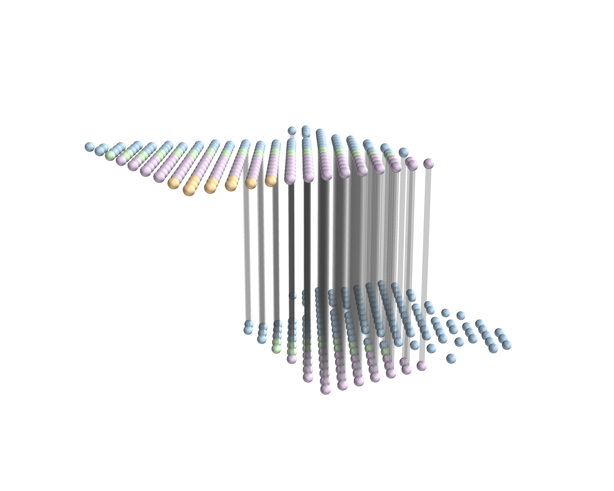
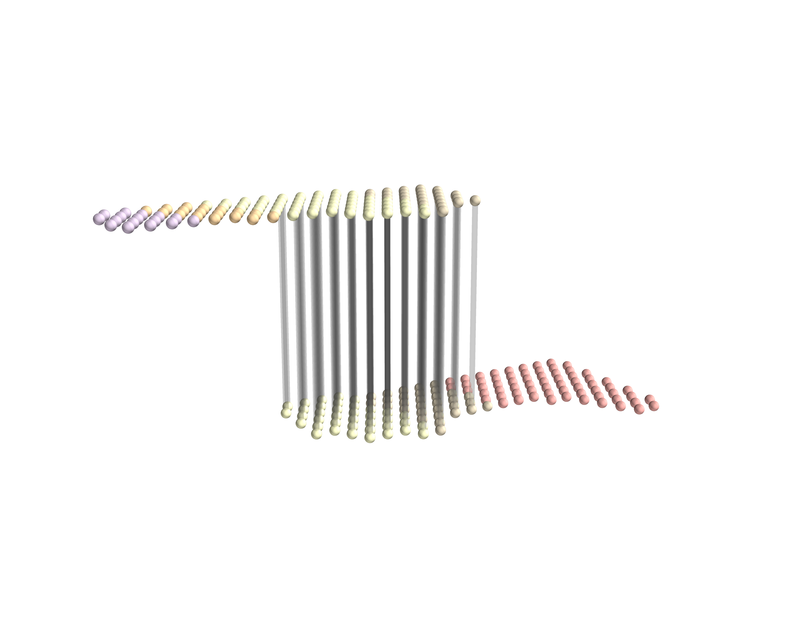

# Experiments

This page documents representative experiments reproduced using the
packaged **RAFT-UP** implementation.

All experiments were rerun after refactoring the codebase into a
reproducible Python package (`raftup`).

Each experiment corresponds to a concrete notebook that can
be executed end-to-end.

---

## Full slice alignment (Adjacent DLPFC slices) 

**Setting**
- Dataset: DLPFC
- Distance between slices: 10 μm
- Layer-wise accuracy: 
- Geometric preservation rate: 

## Full slice alignment (Far-apart DLPFC slices)

**Setting**
- Dataset: DLPFC
- Distance between slices: 300 μm
- Layer-wise accuracy: 
- Geometric preservation rate: 

---

## Full slice alignment (Adjacent MERFISH slices)

**Setting**
- Dataset: MERFISH
- Distance between slices: 50 μm
- Layer-wise accuracy: 
- Geometric preservation rate: 

## Full slice alignment (Far-apart MERFISH slices)

**Setting**
- Dataset: MERFISH
- Distance between slices: 150 μm
- Layer-wise accuracy: 
- Geometric preservation rate: 

---

## Overlapping-window alignment (regular window)

**Setting**
- Dataset: DLPFC
- Window type: overlapping regular window
- Layer-wise accuracy: 
- Geometric preservation rate:

---

## Overlapping-window alignment (irregular window)

**Setting**
- Dataset: DLPFC
- Window type: overlapping irregular window
- Layer-wise accuracy: 
- Geometric preservation rate:

---

## Spatiotemporal trajectories across developmental stages

**Setting**
- Dataset: Stereo-seq mouse midbrain from E12.5 to E14.5 and from E14.5 to E16.5. Cells are colored
by the expert annotations from original study: RGC, radial glia cell; GlioB, glioblast; NeuB, neu-
roblast

## Spatially preserving analysis of cell-cell communication across slices

**Setting**
- Dataset: COMMOT is applied independently to each slice to infer cell-cell communication (CCC). CCC inferred on slice A is transferred to slice B using the RAFT-UP spot-to-spot mapping, enabling direct comparison to CCC inferred on
slice B, and vice versa
