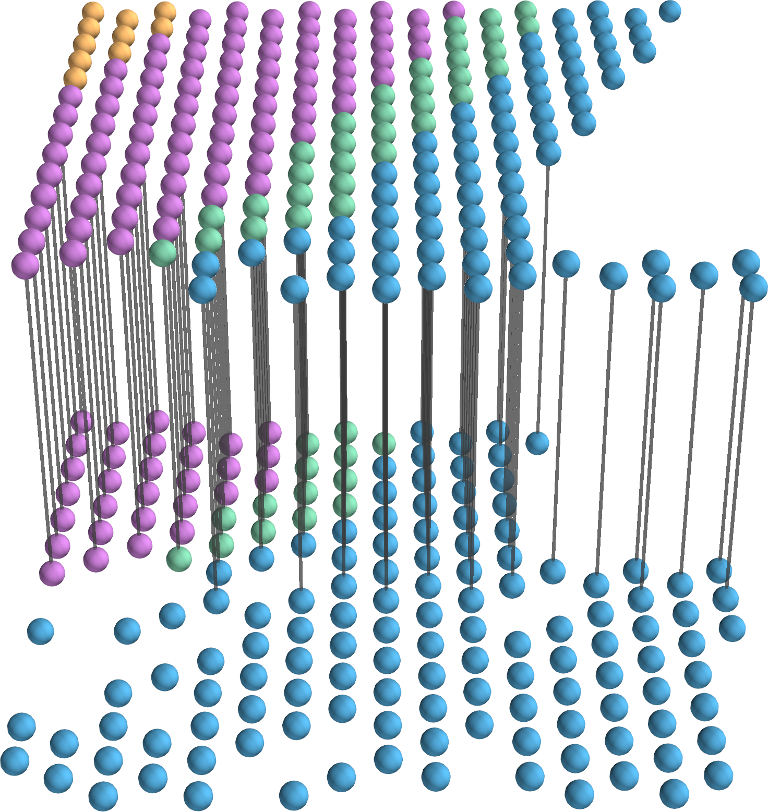
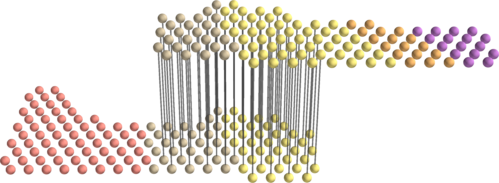
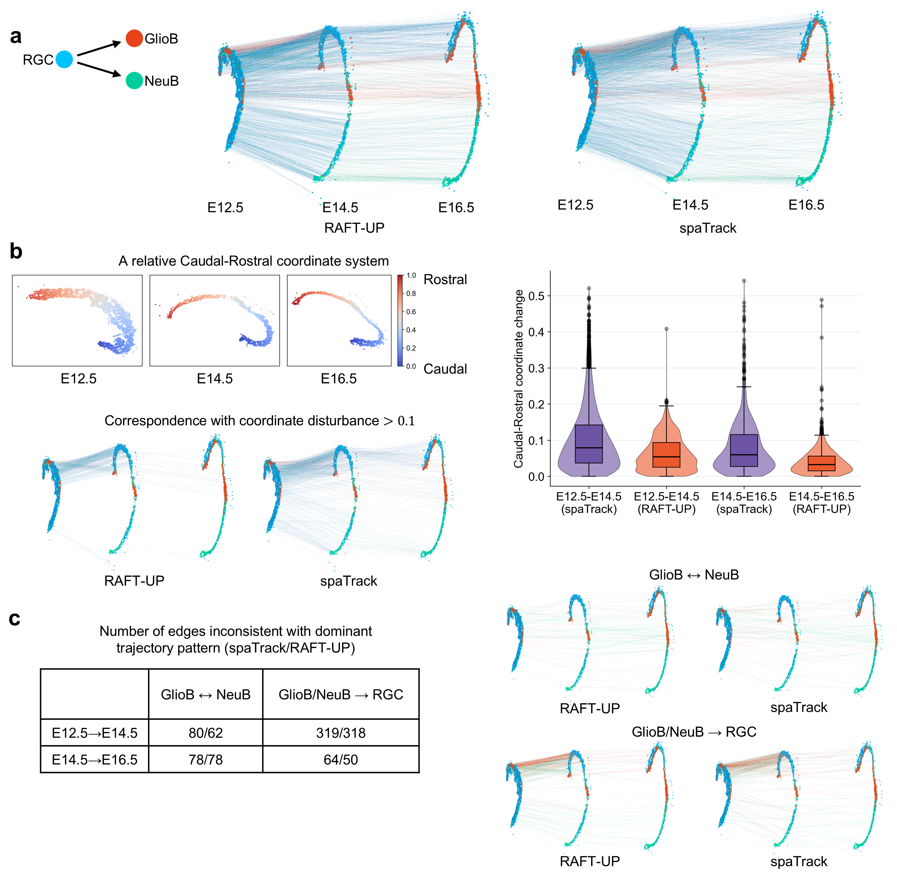

# Experiments

This page documents representative experiments reproduced using the
packaged **RAFT-UP** implementation.

Details of every experiment are reported in https://github.com/L1feiyu/raftup_repo/tree/main/examples.

---

## Full slice alignment (Adjacent DLPFC slices) 

**Setting**
- Dataset: DLPFC 151509 - DLPFC 151510
- Distance between slices: 10 μm
- Layer-wise accuracy: 89.3%

## Full slice alignment (Far-apart DLPFC slices)

**Setting**
- Dataset: DLPFC 151508 - DLPFC 151509
- Distance between slices: 300 μm
- Layer-wise accuracy: 86.7%

---

## Full slice alignment (Adjacent MERFISH slices)

**Setting**
- Dataset: MERFISH -0.04 - MERFISH -0.09
- Distance between slices: 50 μm
- Layer-wise accuracy: 77.7%

## Full slice alignment (Far-apart MERFISH slices)

**Setting**
- Dataset: MERFISH -0.04 - MERFISH -0.19
- Distance between slices: 150 μm
- Layer-wise accuracy: 74.8%

---

## Overlapping-window alignment (synthetic regular window)

**Setting**
- Dataset: DLPFC 151675 window - DLPFC 151675 window 
- Window type: overlapping regular window
- Layer-wise accuracy: 100% and number of aligned spots consistent with ground truth

---

## Overlapping-window alignment (synthetic irregular window)

**Setting**
- Dataset: DLPFC 151675 window - DLPFC 151675 window
- Window type: overlapping irregular window
- Layer-wise accuracy: 100% and number of aligned spots consistent with ground truth

---

## Spatiotemporal trajectories across developmental stages

**Setting**
- Dataset: Stereo-seq mouse midbrain from E12.5 to E14.5 and from E14.5 to E16.5. Cells are colored
by the expert annotations from original study: RGC, radial glia cell; GlioB, glioblast; NeuB, neu-
roblast

## Spatially preserving analysis of cell-cell communication across slices

**Setting**
- COMMOT(https://commot.readthedocs.io/en/latest/) is applied independently to each slice to infer cell-cell communication (CCC). CCC inferred on slice A is transferred to slice B using the RAFT-UP spot-to-spot mapping, enabling direct comparison to CCC inferred on
slice B, and vice versa
