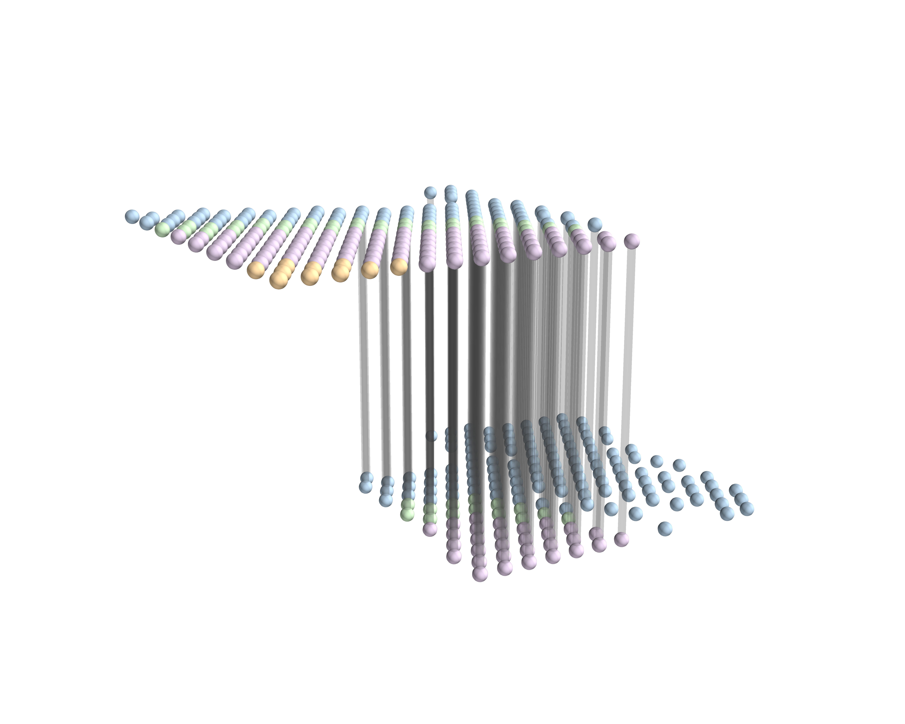
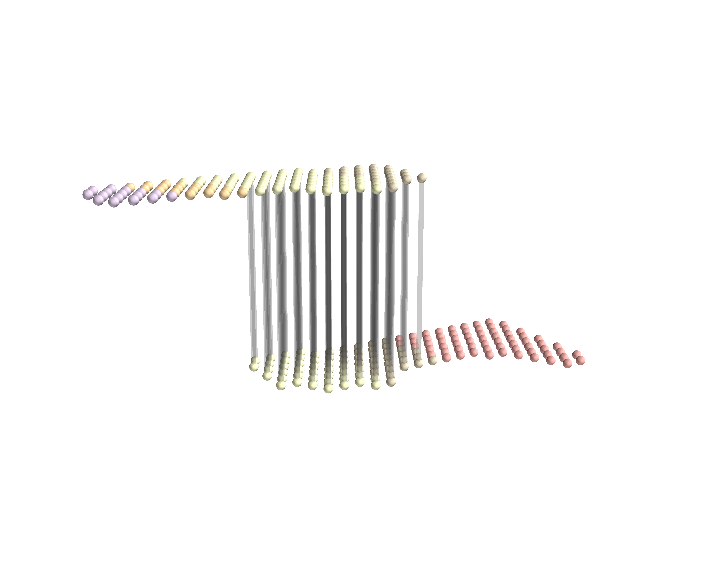

# Results

This page presents representative results reproduced using the packaged
**RAFT-UP** implementation.

All figures shown below were regenerated after refactoring the codebase
into a standalone Python package. They serve as **regression validation**
to confirm that the packaged implementation reproduces previously
verified experimental results.

---

## Overlapping-window alignment (regular window)

**Setting**
- Dataset: DLPFC
- Window type: overlapping regular window
- Feature threshold: 10%
- Spatial threshold: 50 μm
- GW cutoff: 50
- CC cutoff: 0.1

This experiment demonstrates stable alignment between two adjacent
DLPFC subslices under a regular overlapping window configuration.
Only the top-1 optimal transport edge per source cell is visualized.

---

## Overlapping-window alignment (irregular window)

**Setting**
- Dataset: DLPFC
- Window type: overlapping irregular window
- Feature threshold: 10%
- Spatial threshold: 50 μm
- GW cutoff: 50
- CC cutoff: 0.1

Compared to the regular window setting, this experiment evaluates the
robustness of RAFT-UP under irregular overlapping regions. The alignment
structure remains consistent despite increased geometric variability.

---

## Notes on reproducibility

- All results were generated using the same conda environment
  (`raftup_env`) documented in the *Installation* page.
- Visualization was performed using optional 3D rendering utilities
  (e.g. Mayavi), which are not required for running core RAFT-UP methods.
- Raw experimental outputs are intentionally excluded from the repository;
  only selected figures necessary for documentation and validation are included.
